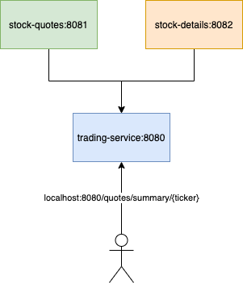

# 202107001 webflux workshop
https://reactor.github.io/head-first-reactive-with-spring-and-reactor/
를 참조 하고 프로젝트를 구성 하였습니다.
## 사전 필수 설치
* JDK11

## Project 구성

* stock-quotes
  * Function Handler, Router 방식에서 RestController로 변경 했습니다.
  * Flux 의 Content-Type을 deprecated 된 application/stream-json 에서 application/x-ndjson 형식으로 변경 했습니다.
```shell
$ curl http://localhost:8081/quotes -i -H "Accept: application/x-ndjson"
HTTP/1.1 200 OK
transfer-encoding: chunked
Content-Type: application/stream+json

{"ticker":"CTXS","price":84.0,"instant":1494841666.633000000}
{"ticker":"DELL","price":67.1,"instant":1494841666.834000000}
{"ticker":"GOOG","price":869,"instant":1494841667.034000000}
{"ticker":"MSFT","price":66.5,"instant":1494841667.231000000}
{"ticker":"ORCL","price":46.13,"instant":1494841667.433000000}
{"ticker":"RHT","price":86.9,"instant":1494841667.634000000}
{"ticker":"VMW","price":93.7,"instant":1494841667.833000000}
```
* stock-details
* trading-service
```shell
# 제대로 노출
curl http://localhost:8080/quotes/summary/GOOG

# 응답이 없어 timeout을 기다리는 호출
GET http://localhost:8080/quotes/summary/PVTL
```

의 spring-boot App 을 instance 로 만든 뒤 서로 reactive 하게 연동 하는 예제 입니다.
